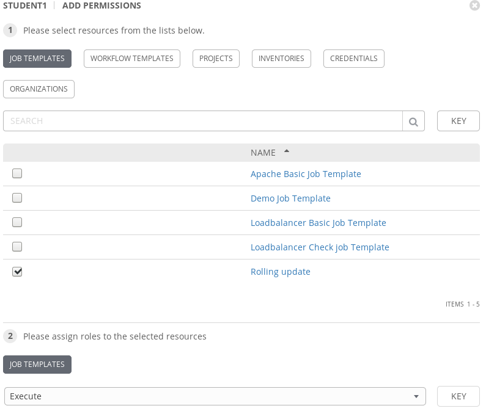
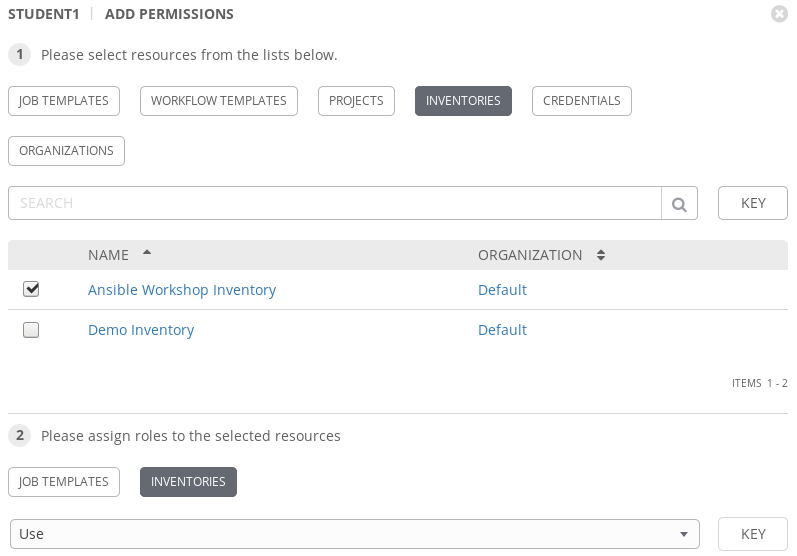
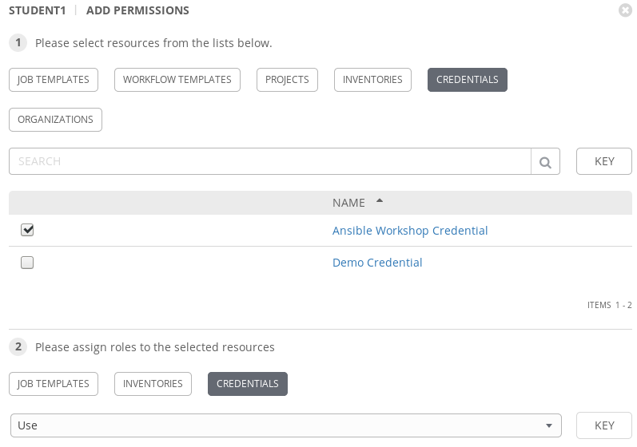

# Exercise 9 - Tower Role Based Access Control

Tower has built-in Role Based Access Control (RBAC). Tower administrators can delegate access to server inventories, organizations, and more. Administrators can also centralize the management of various credentials, allowing end users to leverage a needed secret without ever exposing that secret to the end user. In this exercise we will explore RBAC within Tower.

### Step 1: Create a new user

In the Tower UI, click on `Users` and then click the green `+` button to create a new user. Let's create a user for our student account. Replace `##` with your student number. Fill in the form with the following information.

FIRST NAME |student##
ORGANIZATION|Default
EMAIL|student##@localhost
USERNAME|student##
PASSWORD|ansible
CONFIRM PASSWORD|ansible
USER TYPE|Normal User

Click `save`. Don't leave this screen yet. We are going to assign permissions to this user.

### Step 2: Assign Permissions

Click on the `Permissions` button. Now click the green `+` button so we can assign some permissions to our user. 

First let's assign permissions to a job template. Check the box next to rolling update and then assign `Execute` permissions.

Next let's assign permissions to an inventory. Press the `Inventories` button. Check the box next to `Ansible Workshop Inventory` and assign `Use` permissions.

Finally we need to assign permissions to some credentials. Press the `Credentials` button. Check the box next to `Ansible Workshop Credential` and assign `Use` permissions.

Press `save` when finished.

### Step 3: Log in as your student user. 

Press the power button in the top right corner of the Tower UI to logoff.

Now log in as studentxx with the password you set in step 1.

You should only be able to see the objects which we assigned permissions to as the student user. For example, in the `Templates` screen you will see permissions to execute the job but no permissions to edit it. Review the permissions for the inventory and credential as well.

### Step 4: Review

Feel free to launch the rolling update job template as the student user. Ansible is a desired state engine so we shouldn't see any changes taking place when re-running this task with many steps being skipped.

In this exercise we have reviewed the RBAC capabilities built into Ansible Tower. We created a basic user who we only allowed permissions to patch servers. This is a simple use case but shows how we can delegate tasks to certain teams without having to give them the keys to the kingdom.

---

[Click Here to return to the Ansible Lightbulb - Ansible Tower Workshop](../README.md)
