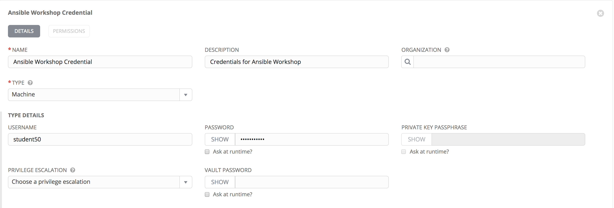
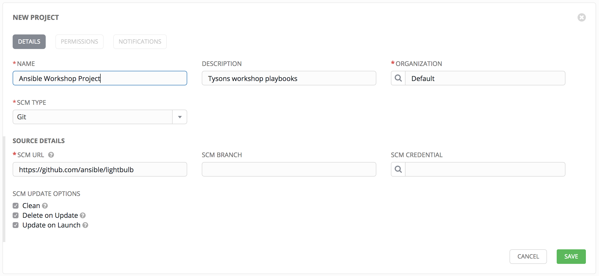

# Exercise 2 - Configuring Ansible Tower

In this exercise, we are going to configure Tower so that we can run a playbook.

## Configuring Ansible Tower

There are a number of contructs in the Ansible Tower UI that enable multi-tenancy, notifications, scheduling, etc. However, we are only going to focus on a few of the key contructs that are required for this workshop today.

* Credentials
* Projects
* Inventory
* Job Template

## Logging into Tower and Installing the License Key

### Step 1:

To log in, use the username `admin` and the admin password you set in the inventory file.

As soon as you login, you will prompted to request a license or browse for an existing license file

### Step 2:

In a separate browser tab, browse to [https://www.ansible.com/workshop-license](https://www.ansible.com/workshop-license) to request a workshop license.

### Step 3:

Back in the Tower UI, choose BROWSE  and upload your recently downloaded license file into Tower.

### Step 4:

Select "_I agree to the End User License Agreement_"

### Step 5:

Click on SUBMIT 

## Creating a Credential

Credentials are utilized by Tower for authentication when launching jobs against machines,
synchronizing with inventory sources, and importing project content from a version control system.

There are many [types of credentials](http://docs.ansible.com/ansible-tower/latest/html/userguide/credentials.html#credential-types) including machine, network, and various cloud providers.

In this workshop, we're going to setup AWS and machine credentials to demonstrate their use.

### Step 1:

Select CREDENTIALS

### Step 2:

Click on ADD 

### Step 3:

Complete the credential form using the following entries:

NAME |AWS ec2 workshop
DESCRIPTION|AWS ec2 workshop credentials
ORGANIZATION|Default
TYPE|Amazon Web Services
ACCESS KEY| <ask your instructor for details>
SECRET KEY| <ask your instructor for details>
STS TOKEN | <ask your instructor for details>

### Step 4:

Select SAVE 

## Creating a Dynamic Inventory

An inventory is a collection of hosts against which jobs may be launched. Inventories are divided into groups and these groups contain the actual hosts. Groups may be sourced manually, by entering host names into Tower, or from one of Ansible Tower’s supported cloud providers.

An Inventory can also be imported into Tower using the `tower-manage` command and this is how we are going to add an inventory for this workshop.

We are going to use the AWS dynamic inventory script to pull in the infrastructure we've create so far during this workshop. NOTE: that you will now see EVERYONES instances etc!

### Step 1:

Click on INVENTORIES

### Step 2:

Select ADD  and select Inventory.

### Step 3:

Complete the form using the following entries

NAME |Ansible AWS Workshop Inventory
DESCRIPTION|Ansible AWS Workshop Inventory
ORGANIZATION|Default

### Step 4:

Select SAVE 

### Step 5:

Click on SOURCES and select ADD .

### Step 6:

Complete the form using the following entries

NAME |Ansible AWS Workshop Dynamic Inventory
DESCRIPTION|Ansible AWS Workshop Dynamic Inventory
SOURCE|Amazon EC2
CREDENTIALS|AWS ec2 workshop

### Step 7:

Select SAVE 

### Step 8:

Scroll down to the Ansible AWS Workshop Inventory, at the bottom of the screen and Click on SYNC ALL.

Notice the green flashing cloud symbol? Click on that and it'll take you to the JOBS dashboard where you'll see the job running and pulling in the dynamic inventory from AWS.

## Creating a Project

A Project is a logical collection of Ansible playbooks, represented in Tower. You can manage playbooks and playbook directories by either placing them manually under the Project Base Path on your Tower server, or by placing your playbooks into a source code management (SCM) system supported by Tower, including Git, Subversion, and Mercurial.

### Step 1:

Click on PROJECTS

### Step 2:

Select ADD 

### Step 3:

Complete the form using the following entries

NAME |Ansible Workshop Project
DESCRIPTION|workshop playbooks
ORGANIZATION|Default
SCM TYPE|Git
SCM URL| https://github.com/ansible/lightbulb
SCM BRANCH|
SCM UPDATE OPTIONS| [x] Clean    [x] Delete on Update   [x] Update on Launch

### Step 4:

Select SAVE 

---

[Click Here to return to the Ansible Lightbulb - Ansible Tower Workshop](../README.md)
